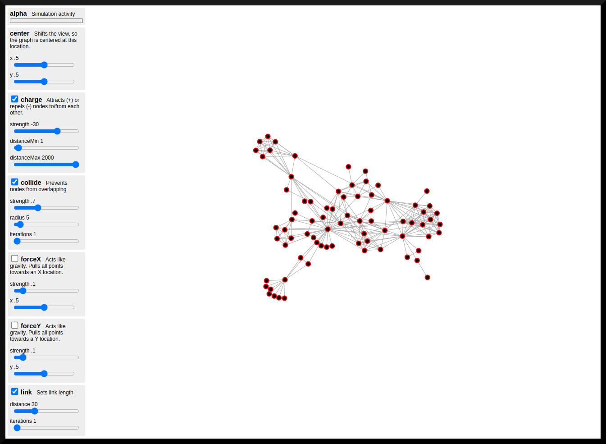

# D3.js Network Force Ts

This demo lets you interactively try various settings and combinations of forces for [d3-force](https://github.com/d3/d3-force).

It's based on [Mike Bostock's](https://bost.ocks.org/) example code for a [force directed graph](http://bl.ocks.org/mbostock/2675ff61ea5e063ede2b5d63c08020c7).

Using version `d3.v5` : `vanilla-ts`.

## Screenshot



## Caveats

Updated to `D3 v5.16.0`.

In order to get the demo working properly, I had to make the following changes.

Added the following 

main.ts
```
export { d3, forceProperties, updateAll };

// Changed:
// d3.json("miserables.json", (error: any, _graph: any) => {
//     ...
// });
//
// To:
///
// Load the data, see: https://github.com/d3/d3/blob/main/CHANGES.md#changes-in-d3-50
graph = await d3.json("miserables.json");

```

index.html
```
<script type="module" src="./src/main.ts"></script>
<script type="module">
  import { d3, forceProperties, updateAll } from "./main.js";
  window.d3 = d3;
  window.forceProperties = forceProperties;
  window.updateAll = updateAll;
</script>
```

package.json
```
{
  "name": "d3-network-force-ts",
  ...
  "dependencies": {
    "d3": "^5.16.0"
  },
  "devDependencies": {
    "@types/d3": "^5.16.7",
    ...
  }
}
```

## References

* [d3](https://d3js.org)
* [d3 hierarchy](https://d3js.org/d3-hierarchy)
* [force directed graph](https://observablehq.com/@d3/force-directed-graph/2)
* [demo](https://gist.github.com/steveharoz/8c3e2524079a8c440df60c1ab72b5d03)
* [CHANGES.md](https://github.com/d3/d3/blob/main/CHANGES.md)
* [miserables.json](https://gist.githubusercontent.com/steveharoz/8c3e2524079a8c440df60c1ab72b5d03/raw/7c039c6b78eea9c97ce763e5fddbfa47c99661f9/miserables.json)
